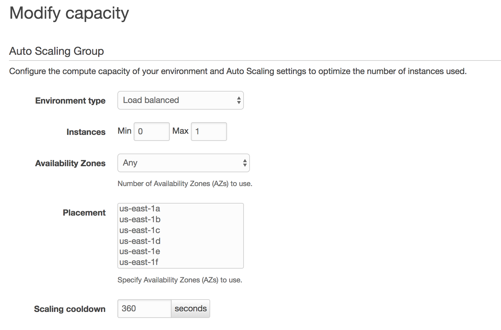
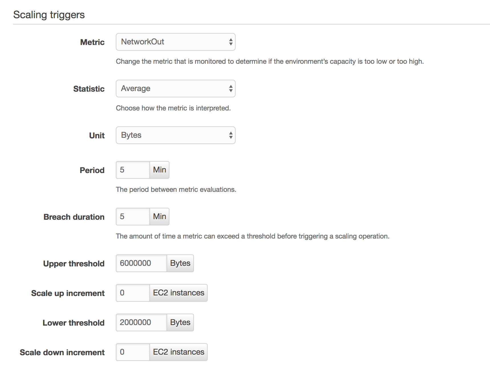
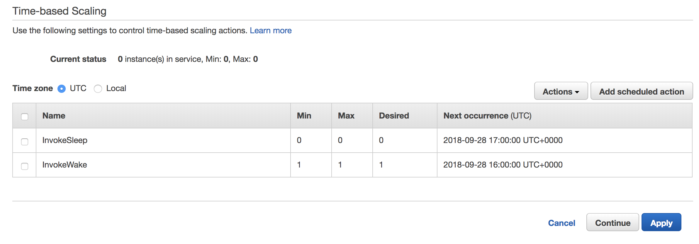
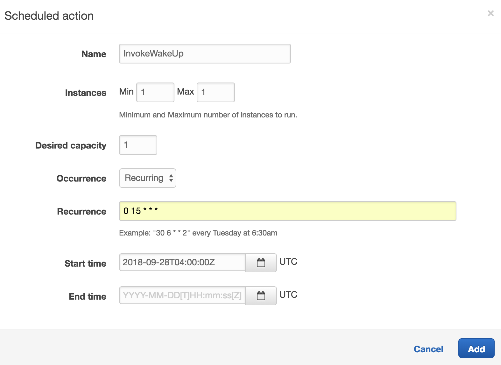
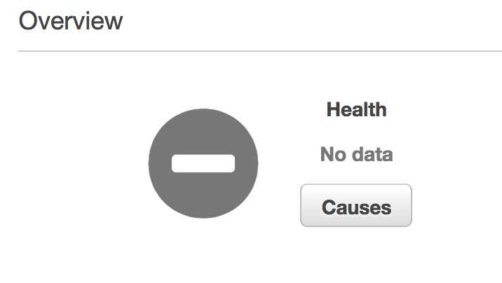

This guide is going to show you a simple way to schedule your AWS EC2 instances for applications using Elastic Beanstalk. Doing this allows you to **reduce your AWS bill** by minimizing the amount of time you run your instances.

This can be useful if you have a separate environment that runs periodic jobs. In my case, I only needed to run the matching algorithm job for my side project [Fest Tribe](https://www.festtribe.com) once a day. I have a separate worker environment (named `festtribe-worker`) that runs this job so that I don't slow down the application that users visit.

To begin, go to your Elastic Beanstalk dashboard and select the environment that contains the instance(s) you would like to schedule. Click on "Configuration" on the left menu so that you see a screen that looks similar to the screenshot above.

Before you make any changes to your environment, be sure to save your current configuration by clicking on the "Actions" button on the right side of the screen and selecting "Save Configuration". It might also be a good idea for you to clone your environment before you follow these steps so that you can test out these changes before making any destructive changes to your existing application.

Click on the "Modify" link for the Capacity setting. Set your "Environment Type" to "Load balanced" and determine the maximum and minimum number of instances you want to run. I chose 0 for the min and 1 for the max since I only need to run one instance for when the job is running, and won't need to run any instances when the job isn't running.

Change the "Scale up increment" and "Scale down increment" to 0 since we won't need to auto-scale based on any of the given parameters. We only need to scale based on the times we enter under the "Time-based Scaling" section.

Click on the "Add scheduled action" button and create an action with settings similar to the screenshot below. This will be the action that tells AWS when you want your instance to start running. The cron schedule of `0 15 * * *` will make this action start at 15:00 UTC everyday. Note that you can leave the "End time" field empty. Click the "Save" button when you're finished.

Create another Scheduled Action with similar settings to create an action that tells AWS when you want your instance to *stop* running. I changed the "Name" of the action to "InvokeSleep", min and max instances to zero, and "Recurrence" to `0 16 * * *` so that the instance is running one hour per day (15:00 to 16:00 UTC).

Once you're happy with your scheduled actions, click on the "Apply" button and these changes should take into effect! Note that you'll need to wait for the "Next occurrence" of these actions to notice any differences. You can check how many instances are running by looking at the "Current status" field under the Time-based Scaling section. Your environment health will show "No data" when no instances are running.

That's it! Hope you found this useful. Feel free to leave a comment or [reach out on twitter](https://www.twitter.com/lVlars) if you have any questions.
